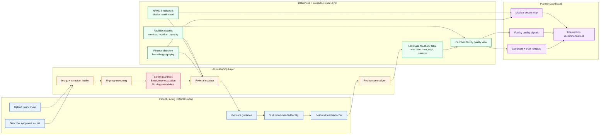

# Patient-to-Planner Health Access Loop

Patients get safer referral guidance; their post-visit feedback enriches facility intelligence for planners.

## Track Coverage

- **Track 2: Medical Desert Planner**: identifies underserved districts and facility gaps.
- **Track 3: Referral Copilot**: helps patients find appropriate care based on injury context and available facilities.
- **Track 4: Data Readiness Desk**: captures post-visit feedback and turns it into structured facility quality signals.
